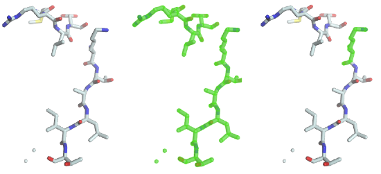

Introduction to the :mod:`~ost.mol` Module
================================================================================

For the course of this tutorial, we assume that you have :ref:`DNG up and running <start-dng>`.

Loading and inspecting a protein structure
--------------------------------------------------------------------------------

The code to load and save structures is not directly part of the mol module, but rather lives in a module dedicated to input and output of any kind of data: The 
:mod:`~ost.io` module. We will be using functions of this module to load 
structures. 

One of the most commonly used file formats for macromolecular structures are 
PDB (Brookhaven Protein Data Bank) files. The official name for  molecules 
stored in a PDB file is an *entity* and we decided to follow this convention 
in OpenStructure. You will hear this word all the time, but you can replace 
the word entity with molecule (or most of the time even protein) in your head.

Loading a PDB file leaves you with an :class:`~ost.mol.EntityHandle`. This is
the central class holding together :class:`chains <ost.mol.ChainHandle>`,
:class:`residues <ost.mol.ResidueHandle>` and
:class:`atoms <ost.mol.AtomHandle>` in a straight-forward hierarchy. This
hierarchy will always be intact: there are no atoms without a residue they
belong to and no residues without chains which have to belong to an entity.
Beside the molecule itself, there are a lot of additional attributes stored in
the entity, like the
:attr:`centre of mass <ost.mol.EntityHandle.center_of_mass>`.

To load a PDB file, simply type

.. code-block:: python

   fragment = io.LoadPDB('/path/to/examples/code_fragments/entity/fragment.pdb')

This will load the fragment from the specified file 'fragment.pdb' and store the 
result in fragment.  The :func:`~ost.io.LoadPDB` has many options, which, for
simplicity will not be discussed here. If you want to know more about the 
function, type:

.. code-block:: python

   help(io.LoadPDB)

or read the :func:`online documentation <ost.io.LoadPDB>`.
     
The loaded structure is an instance of :class:`~ost.mol.EntityHandle` which offers a comprehensive interface to inspect an manipulate molecular structures. Now let's inspect what we just loaded:

.. code-block:: python

   print(len(fragment.chains), fragment.chains)
   print(len(fragment.residues), fragment.residues)
   print(len(fragment.atoms), fragment.atoms)

As you can see, our fragment consists of one peptide chain of 12 amino acids and 
has 81 atoms in total. Now let's examine our fragment in more detail. Enter the 
command
    
.. code-block:: python

  for residue in fragment.residues:
    print(residue, 'has', len(residue.atoms), 'atom(s).')
    for atom in residue.atoms:
      print(' ', atom.name, atom.pos)

This will group the atoms by residue. And, for completeness, we will first group them by chain, then by residues.

.. code-block:: python

  for chain in fragment.chains:
    print('chain', chain.name, 'has', len(chain.residues), 'residue(s)')
    for residue in chain.residues:
      print(' ', residue, 'has', len(residue.atoms), 'atom(s).')
      for atom in residue.atoms:
        print('    ', atom.name, atom.pos)

A protein fragment would not be complete without bonds. Let's see 
what bonds we have in there:

.. code-block:: python
  
  for bond in fragment.bonds:
    print(bond)
    
Let There Be Shiny Graphics
--------------------------------------------------------------------------------

For visually inspecting the fragment, we now create a graphical representation 
of the entity. The graphical representation is completely separate from the :class:`~ost.mol.EntityHandle` class. This is on purpose. When writing processing scripts, usually no graphical representation is required and things would be slowed down without any reason. The following code will take our fragment and initialise a :class:`gfx.Entity<ost.gfx.Entity>`, add it to the scene, and center the camera on it.

.. code-block:: python
  
  go = gfx.Entity("Fragment", fragment)
  scene.Add(go)
  scene.CenterOn(go)

Now you will see the fragment in the 3D window.

Use the mouse to rotate, zoom in and shift the camera. Double clicking on an 
atom will center the camera on that atom. If you want to learn more about the 
:mod:`~ost.gfx` module, you are encouraged to read :doc:`the gfx 
intro<intro-03>` and the :mod:`gfx documentation<ost.gfx>`.

Introduction to Views
--------------------------------------------------------------------------------

Often during processing and visualisation of data, only parts of a protein 
structure are of interest. This realisation has had a major impact on the
design of OpenStructure and is tied very deeply into the core of the framework. 
Subparts of structure are modelled as so-called :class:`EntityViews 
<ost.mol.EntityView>`. You can think of them as a selection of chains,
residues, atoms and bonds of an entity stored in a variable. A view has almost
the same interface as the underlying entity, making it very easy to mix entity
views with handles in Python due to the dynamic nature of the language. An
algorithm that is written for entities will almost always (with some care) also
work for 
:class:`EntityHandles <ost.mol.EntityHandle>`. This is referred to as 
`duck-typing <http://en.wikipedia.org/wiki/Duck_typing>`_ (I don't care if it 
isn't a duck as long as it looks like a duck), a concept used all over the place
in Python. For views, the same rule as for
:class:`entities <ost.mol.EntityHandle>` applies: No atom can be part of the
view without it's residue.

To familiarize yourself with the concept of views, we will use the fragment in 
the 3D window of the last example.

We will use several ways to select parts of our fragment:
 * By using a dedicated query language
 * By manually constructing a view

The Query Language
--------------------------------------------------------------------------------

The first way to select parts of a structure is with a dedicated mini-language, 
called :doc:`the query language <mol/base/query>`. In the Python shell, type

.. code-block:: python

  go.selection = fragment.Select('')
    
The code performs a selection on the fragment and assigns the resulting view to 
the selection of the graphical object. A green halo will be displayed around the 
selected parts (image in the middle).

As you can see the previous statement created a “full view”, containing all the 
chains, residues, atoms and bonds. To select lysine residues, type

.. code-block:: python

  go.selection = fragment.Select('rname=LYS')
    

As you can see (image on the right), the only lysine residue is now 
highlighted in the 3D window, because it was the only one matching the predicate 
"residue name must be equal to LYS". Several such predicates can be combined 
with boolean operators such as *and* and *or*. To select residues with residue 
number 1 to 3, the following statement will do the job:

.. code-block:: python

  go.selection = fragment.Select('rnum>=1 and rnum<=3')
    
but this is very cumbersome. That's why there is a shortcut to this statement. 
You can specify a range of values.

.. code-block:: python

  go.selection=fragment.Select('rnum=1:3')

For a complete description of what you can do with the query language, have a 
look at the :doc:`../mol/base/query`.

Constructing Views Manually
--------------------------------------------------------------------------------

Sometimes the query language is not enough. For these cases the 
construction of manual entities becomes necessary. This is pretty straight 
forward:

.. code-block:: python

  view = fragment.CreateEmptyView()
  ca = fragment.FindAtom('A', mol.ResNum(1), 'CA')
  cb = fragment.FindAtom('A', mol.ResNum(1), 'CB')
  view.AddAtom(ca)
  view.AddAtom(cb)
  go.SetSelection(view)

The last step sets our constructed view as the current selection, displaying it 
in the 3D window. As you can see, C-alpha and C-beta of the first residue are 
not connected by bonds, even though both atoms are in the view. You have either 
to add the bond manually with

.. code-block:: python

  ca_cb = ca.FindBondToAtom(cb)
  view.AddBond(ca_cb)
    
Or, as a very convenient shortcut 
:meth:`view.AddAllInclusiveBonds()<ost.mol.EntityView.AddAllInclusiveBonds>` to 
add all bonds that have both bonding partners in the view.

Don't forget to update the selection of the graphics object to see what view you 
have created.

.. code-block:: python

  go.SetSelection(view)

Saving an Entity
--------------------------------------------------------------------------------

Saving an entity (or a view) is a breeze:

.. code-block:: python

   io.SavePDB(fragment, 'full.pdb')

will save the full fragment. To save only the backbone atoms, we can first 
select the backbone atoms and then save it:

.. code-block:: python

   io.SavePDB(fragment.Select('aname=CA,C,N,O'), 'backbone.pdb')

That's it for the mol module. Continue with :doc:`part two<intro-02>` of the 
tutorial.

..  LocalWords:  attr
