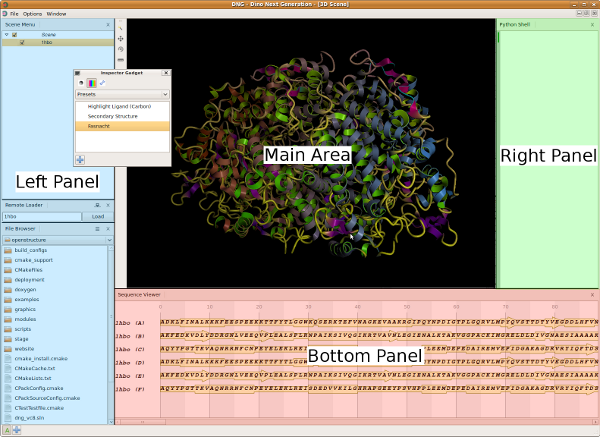

A gentle introduction to OpenStructure
================================================================================

In this tutorial you will be learning by example how to use the OpenStructure 
framework. 

We assume that you already have a version of OpenStructure installed. If not, 
please refer to :doc:`install`.

What will be covered in this tutorial?
--------------------------------------------------------------------------------

The tutorial is divided into several parts. The first part of the tutorial is a 
walk-through of the basic functionality you will be using in your everyday work, followed by an introduction to the :mod:`~ost.mol`, :mod:`~ost.img` and :mod:`~ost.seq` modules.

.. toctree::
  :maxdepth: 1
    
  intro-01
  intro-02
  intro-03

.. _start-dng:

Getting ready to rumble
--------------------------------------------------------------------------------

The files we will be using in the tutorial are available in the examples
directory that comes with OpenStructure. Depending on your platform, the
examples are located at a different location:

 * on *MacOS X* the files are located inside the application bundle (DNG.app).
   The file browser will automatically point to the examples.
 * on *Linux* PREFIX/share/openstructure/examples, where PREFIX is 
   the path to the directory containing OpenStructure.

Starting DNG
^^^^^^^^^^^^^^^^^^^^^^^^^^^^^^^^^^^^^^^^^^^^^^^^^^^^^^^^^^^^^^^^^^^^^^^^^^^^^^^^

The graphical user interface of OpenStructure is called DNG (Dino/DeepView Next 
Generation). To start it, 

 * on *MacOS X* double click DNG.app
 * on *Linux* fire up a terminal change into the OpenStructure installation 
   directory and type 'bin/dng'. If you have the binary directory in the PATH, 
   typing dng is sufficient.

Interactive Python Shell
^^^^^^^^^^^^^^^^^^^^^^^^^^^^^^^^^^^^^^^^^^^^^^^^^^^^^^^^^^^^^^^^^^^^^^^^^^^^^^^^

Now we will enter commands in the Python Shell (in the screenshot above, the 
python shell (shown in green) is located at the right of the main window). If you want to get 
more information on any object, function or class, the python help command may 
be useful. For example:

  .. code-block:: python

    # get list of methods of EntityView
    help(mol.EntityView)
    # get help for method Select
    help(mol.EntityView.Select)
    
Continue with :doc:`part one <intro-01>`
