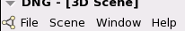

Dialogs
================================================================================
.. currentmodule:: ost.gui

OpenStructure provides several :class:`Dialogs` which can be called from its
many menus in the top bar. 

 

Scene Menu
--------------------------------------------------------------------------------

Superpose
^^^^^^^^^

  Structurally superpose two entities.

  .. image:: images/100624_superpose_dialog.png  

  The ``Superpose`` entry in the ``Scene`` menu is only accessible if two
  instances of the graphical :class:`~ost.gfx.Entity` are selected. 

  .. autoclass:: ost.gui.dng.superpositiondialog.SuperpositionDialog
