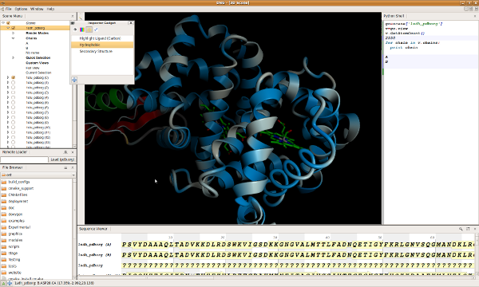

:mod:`~ost.gui` -- Graphical User Interface
================================================================================

.. module:: ost.gui

The GUI of OpenStructure is designed to be intuitive, flexible and extensible. 

All parts of the GUI are exported to Python and can be expanded with 
C++ Qt widgets as well as with PyQt widgets. Learn more about :doc:`python_cpp`.

.. toctree::

  layout
  python_cpp
  scene_win
  tools
  python_shell
  sequence_viewer
  dialogs
