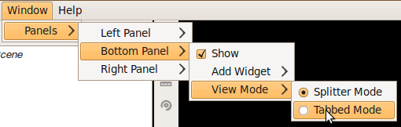
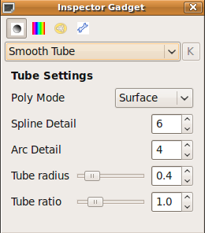

Layout
================================================================================
.. currentmodule:: ost.gui

Most of the widgets are organized in a big main window which is divided into
four parts: the :class:`MainArea` and three panels (which are organized by the 
:class:`PanelManager`) containing one or more smaller widgets:

.. image:: images/100208_OpenStructure_UI_Colored.png

The panels primarily contain widgets interacting with the 3D window.

Drag and Drop support
--------------------------------------------------------------------------------
The user interface of OpenStructure supports drag and drop events. Every file
format that is supported by Openstructure can be opened by dragging and dropping
it on the main window. When a python script (ending with .py) is being dropped
on the UI, the script will be executed. For any other file type (for example PDB
files, images and density maps), OpenStructure will try to load the file and
display it in the 3D window, in the data viewer for images or in the sequence
viewer.

Perspective
--------------------------------------------------------------------------------

.. class:: Perspective

  The perspective manages the layout of the widgets inside the main window.
  It contains important classes which itself manages again a sub part of the whole layout.
  You can get the active perspective object from the gosty app:

  .. code-block:: python
  
    app=gui.GostyApp.Instance()
    perspective=app.perspective

  .. method:: GetMainArea()
  
    Returns the main area which is used in this perspective.
    
    :rtype: :class:`MainArea`

  .. method:: GetMenu(name)
    
    Get QMenu that corresponds to the given name.
    If it does not exist, it will be created and returned.
    
    :param name: The name of the menu
    :type  arg2: :class:`str`
    :rtype: :class:`QtCore.QMenu`

  .. method:: GetMenuBar()
  
    Returns the Menubar of the Application. Can be used to add some menupoints.
    
    :rtype: :class:`QtCore.QMenuBar`

  .. method:: GetPanels()

    The PanelManager class organizes all the widgets in the side panels.
    Returns the PanelManager instance which is used in this perspective.

    :rtype: :class:`PanelManager`

  .. method:: HideAllBars()

     Hides all side bars. Can be used if the MainArea should be expanded to full size.
  
  .. method:: StatusMessage(message)
  
    Set a status message. This method can also be called from Qt as slot.
    
    :param message: The message that will be displayed in the status bar.
    :type  message: :class:`str`

Main Area
--------------------------------------------------------------------------------
Adding an own Widget
^^^^^^^^^^^^^^^^^^^^
The :class:`MainArea` is a mdi (multi document interface). Therefore it's
possible to display multiple widgets in it. The following example demonstrates 
how to add a  widget to the MDI area:

  .. code-block:: python
  
    app=gui.GostyApp.Instance()
    main_area=app.perspective.main_area
    label=QtGui.QLabel("Hello World")
    main_area.AddWidget("The beginning..", label)
    
.. class:: MainArea

   It is implemented as a MDI (multi document interface). This allows you to add custom widgets to it.

  .. method:: AddPersistentWidget(title, name, widget [, window_state])

    add a widget whose geometry is preserved across application relaunches.
    For widgets that are volatile, use :meth:`AddWidget`
    If tabbed mode is enabled, the widget geometry is ignored.

    :param title: string that is displayed in the gui
    :type  title: :class:`str`
    :param name: is the unique name (within the scope of the main area) for the widget that is used to restore and save the widget geometry.
    :type  name: :class:`str`
    :param widget: is the widget to be added to the main area
    :type  widget: :class:`QtCore.QWidget`
    :param window_state: custom window_state for the widget. See Qt Documentation to learn more about WindowStates.
    :type  name: :class:`QWindowState`

  .. method:: AddPersistentWidget(title, name, widget, width, height, x, y)

     add a widget whose geometry is preserved across application relaunches
     For widgets that are volatile, use #AddWidget()
     If tabbed mode is enabled, the widget geometry is ignored.

    :param title: string that is displayed in the gui
    :type  title: :class:`str`
    :param name: is the unique name (within the scope of the main area) for the widget that is used to restore and save the widget geometry.
    :type  name: :class:`str`
    :param widget: is the widget to be added to the main area
    :type  widget: :class:`QtCore.QWidget`
    :param width: width of the widget inside the mdi
    :type  width: :class:`int`
    :param height: height of the widget inside the mdi
    :type  height: :class:`int`
    :param x: x position of the widget inside the mdi
    :type  x: :class:`int`
    :param y: y position of the widget inside the mdi
    :type  y: :class:`int`

  .. method:: AddWidget(title, widget)
  
    add volatile widget
  
    :param title: string that is displayed in the gui
    :type  title: :class:`str`
    :param widget: is the widget to be added to the main area
    :type  widget: :class:`QtCore.QWidget`

  .. method:: ShowSubWindow(widget)
  
    display the given widget inside the main area
    This method can be used to make a widget visible that has been added to the mdi area.
    This method should only be called if you are sure, that the widget has been added to the main area.
    Otherwise, there might be an unexpected behavior!
  
    :param widget: widget which you want to make visible
    :type  widget: :class:`QtCore.QWidget`

  
  .. method:: HideSubWindow(widget)
  
    brief hides the given widget inside the main area
    This method can be used to hide a widget that has been added to this mdi area.
    This method should only be called if you are sure, that the widget has been added to the main area.
    Otherwise, there might be an unexpected behavior!
  
    :param widget: widget which you want to hide
    :type  widget: :class:`QtCore.QWidget`
  
  .. method:: EnableTabbedMode(tabbed_mode)
    
    brief switch between free window and tabbed window mode
     
    :param tabbed_mode: whether you want to enable or disable the tabbed mode. Default is True
    :type  tabbed_mode: :class:`bool`
  
Panels
--------------------------------------------------------------------------------

View Modes
^^^^^^^^^^

Each side panel can have different view modes. View modes can display the widgets 
which are held by the Side Panel in a different style. Every panel has the 
`splitter` and the `tabbed` view mode. The view mode can be changed in the Window 
menu of the Menubar:

Drag and Drop
^^^^^^^^^^^^^

The widgets which are held by a Side Panel can be moved to an other position in 
the panel or even to another side panel. The widget can be moved by simply 
clicking on the border of the widget and drag and drop it to the desired position.
The drag and drop feature is currently supported by the splitter as well as the tabbed view mode.

Adding a custom Widget
^^^^^^^^^^^^^^^^^^^^^^

The Left-, Bottom- and Right-Panel are organized by the :class:`PanelManager`. It is only 
possible to display a widget which is in the widget pool of the PanelManager class. 
Once a widget is in the pool all the methods of the PanelManager class can be used to 
display / hide the widget in any position of the panels. OpenStructure remembers 
the size and location of a Widget. So, OpenStructure should look the same after 
restarting it.

The following example shows, how to add a PyQt Widget to the widget pool and finally 
display it in the right side bar:

  .. code-block:: python
  
    qwidget = QtGui.QLabel("Test")
    widget=gui.WrappedWidget(qwidget)
    panels=gui.GostyApp.Instance().perspective.GetPanels()
    panels.AddWidgetToPool("Test Label",widget)
    panels.AddWidget(gui.PanelPosition.RIGHT_PANEL, widget)
    qwidget.show()

.. class:: PanelManager

  Class which organizes all widgets which are in the side panels
  This class handles all side bar widgets. It can be used to display, hide or move a widget to a :class:`PanelBar`. There are three Bars (left, bottom, right) which are organized by this class.
  Whenever a widget is being removed or added it checks first if the widget type is known and if there are available instances.
  
  .. method:: AddWidget(pos, widget[, hidden])

    Display a Widget in a PanelBar. 
    With Method you can add a widget to the given PanelBar. The widget which finally will be added to the gui will be created from the WidgetRegistry.
    If the WidgetPool does not know the class name of the given widget or if there are no instances left, nothing will happen.

    :param pos: Indicates which PanelBar is affected
    :type  pos: :data:`PanelPosition`
    :param widget: the widget will not directly added to the PanelBar. The class_name will be used to identify the widget in the WidgetRegistry which will return a fresh instance of this class.
    :type  arg3: :class:`int`
    :param hidden: marks if the class should be displayed in the gui. Default the widget will be shown. By default False is set
    :type  hidden: bool

  .. method:: AddWidgetByName(pos, class_name, hidden)

    Display a Widget in a PanelBar
    Same as :meth:`AddWidget`

    :param pos: Indicates which PanelBar is affected
    :type  pos: :class:`PanelPosition`
    :param class_name: the class_name of the widget you would like to add.
    :type  class_name: :class:`str`
    :param hidden: marks if the class should be displayed in the gui. Default the widget will be shown.
    :type  hidden: bool

  .. method:: AddWidgetToPool(class_name, limit)

     Add a widget to the widget pool.
     The widget must already be in the WidgetRegistry.
     If you are not sure if the Widget is in the WidgetRegistry, use the other `AddWidgetToPool` Method instead.

    :param class_name: class name of class which should be added to the widget pool.
    :type  class_name: :class:`str`
    :param limit: amount of parallel instances allowed (-1 if infinite)
    :type  limit: :class:`int`

  .. method:: AddWidgetToPool(name, widget)

     Add a widget to the widget pool. Same as :meth:`AddWidgetToPool`
     
    :param name: Name which is displayed in the gui.
    :type  name: :class:`str`
    :param widget: Widget which will be added to the WidgetPool of this class and the WidgetRegistry. 
    :type  widget: :class:`WrappedWidget`

  .. method:: GetMenu()
    
     The GetMenu method returns a QMenu reference, which contains various actions. The action states will be updated automatically.
     Returns a reference to a QMenu which can be used for example in a QMenuBar
     
    :rtype: :class:`QObject`

  .. method:: GetQObject()

    Get the SIP-QObject (QObject), learn more about :doc:`python_cpp`.
    
    :rtype: PyQt4.QObject

  .. method:: RemoveWidget(widget)

    Remove a Widget out of a PanelBar
    The widget will be removed if it is in a PanelBar
  
    :param arg2: widget which should be removed
    :type  arg2: :class:`WrappedWidget`

.. data:: PanelPosition
 
  This enum indicates the Position of the Panel

  * BOTTOM_PANEL
     The bottom panel  
  * LEFT_PANEL
     The left panel
  * RIGHT_PANEL
      The right panel

Menubar
--------------------------------------------------------------------------------
Adding an new Menupoint
^^^^^^^^^^^^^^^^^^^^^^^
It is really straightforward to add a custom menupoint. Since the menubar is 
exported to Python it is even easier to create such e menupoint. The following example 
describes how this is done within python and PyQt:

.. code-block:: python

  menu_bar=gui.GostyApp.Instance().perspective.GetMenuBar()
  test_action = QtGui.QAction('Test Menu Point', menu_bar) 
  test = menu_bar.addMenu('&Test')
  test.addAction(test_action)

The MenuBar class is a normal Qt QMenubar (see the Qt Documentation for more information 
about QMenubar). By getting the Menubar from the perspective, it is automatically 
converted to a SIP Object which can be used within python.

The Inspector Gadget
--------------------------------------------------------------------------------

.. currentmodule:: ost.gui

With our Inspector Gadget it is straightforward to modify rendering and coloring
options of scene objects without using the keyboard:
 

   
The render and coloring options affect only the currently selected objects of
the scene win. The Shortcut `Ctrl+I` toggles the visibility of the inspector.
 