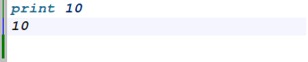
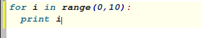
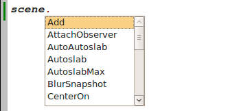
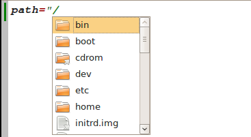

The Python Shell
================================================================================
.. currentmodule:: ost.gui

.. class:: PythonShell

OpenStructure has a powerful Python Shell which has some handy features. It is 
completely integrated into OpenStructure and allows you enter Python code. 

Multi line detection
--------------------------------------------------------------------------------
The Python Shell detects automatically if a code block is complete or not. 
For example a simple print statement in the command line is a complete code 
block. Therefore the code will be executed after pressing enter:
 

When a multiline codeblock (like a for loop or an if instruction) is being 
entered in the command line, the code is not executed until the code block is 
complete:

 
When a code block is not complete, pressing enter appends an empty line at the 
end of the code block. To execute such a code block, you simply have to press 
enter twice. 

Auto completion
--------------------------------------------------------------------------------
After pressing tab in the Python Shell, it returns you possible extensions 
to your entered text. This feature can be used for completing variable names 
or functions:
  

 
It is also possible to complete a file system path string. By pressing tab while
editing a string, the shell displays all file or folders of the given 
directory: 
 

