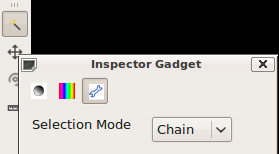

Tools
--------------------------------------------------------------------------------
.. currentmodule:: ost.gui

OpenStructure has several :class:`Tool` options that are all listed in the toolbar
close to the 3D window. A tool is activated upon selecting it in the toolbar.
Input events are sent to the tool as long as the `Ctrl` key (`Cmd` on Mac) is
pressed. For example the rigid body manipulator will rotate and shift the
currently selected nodes in the scene win. Upon releasing `Ctrl`, the events are
sent to the camera, making it possible to rapidly switch between adjusting the
viewing angle of the camera and manipulating the position and orientation of
scene objects.
 

 
The example `Write a Tool in Python` demonstrates how to add a simple tool
(written in Python) to OpenStructure.

.. class:: Tool

  Parameters of the tool that are configurable should be implemented using the
  ToolOptions facility. This automatically takes care of remembering the
  used options over different sessions (in the future) and creates a widget 
  to modify these options.

  input_events Input Events

  Tools receive input events when the Control key (Command on macOS) is
  pressed. This includes both keyboard events and mouse events such as mouse
  move events, clicks and Real clicks.

  Tools only receive mouse move events when one of the mouse buttons is 
  pressed. 

  .. method:: CanOperateOn(nodes)

    Determines if the tool can manipulate a certain :class:`gfx.GfxNode`. 
    This method is used to enabled/disable certain actions (in the toolbar, for example).

    Return True if the Tool can operate on all GfxNodes which are in the given list. Otherwise False 

    :param nodes: List with :class:`gfx.GfxNode`
    :type  nodes: :class:`NodePtrList`
    :rtype: bool

  .. method:: Click(event)

    Left mouse click

    :param event: object with the event information
    :type  arg2: :class:`MouseEvent`

  .. method:: DoubleClick(event)
    
    Double click
    
    :param event: object with the event information
    :type  event: :class:`MouseEvent`

  .. method:: GetIconPath()
    
    Returns the path to an shiny icon. 
    If no path is given, no icon will be displayed
    
    :rtype: :class:`str`

  .. method:: GetName()
    
    Returns the name of the Tool which will be displayed in the gui.
    
    :rtype: :class:`str`

  .. method:: GetToolOptions()

       
    :rtype: :class:`ToolOptions`
    
    
.. class:: ToolOption
  
  Currently, there are four different types of ToolOption which can be used to
  build up your own tool. They will automatically generate the appropriate
  QT widgets:
  
  * :class:`ToolOptionInt` generates a QLineEdit of integer type
  * :class:`ToolOptionFloat` generates a QLineEdit of float type
  * :class:`ToolOptionEnum` generates a QComboBox
  * :class:`ToolOptionButton` generates a QPushButton
  
.. class:: ToolOptionInt(key, verbose_name, default_value, min_value, max_value)
  
  :param key: Internal key name.
  :type  name: str
  :param verbose_name: Name used as label in the widget.
  :type  name: str
  :param default_value: Default value.
  :param min_value: Minimum allowed value.
    Defaults to minimum possible value.
  :param max_value: Maximum allowed value.
    Defaults to maximum possible value.
    
  .. method:: GetDefault()
  
  .. method:: GetUpperLimit()
  
  .. method:: GetLowerLimit()
  
  .. method:: GetValue()
  
  .. method:: SetValue(value)

.. class:: ToolOptionFloat(key, verbose_name, default_value, min_value, max_value)
  
  :param key: Internal key name
  :type  name: str
  :param verbose_name: Name used as label in the widget.
  :type  name: str
  :param default_value: Default value.
  :param min_value: Minimum allowed value.
    Defaults to minimum possible value.
  :param max_value: Maximum allowed value.
    Defaults to maximum possible value.
    
  .. method:: GetDefault()
  
  .. method:: GetUpperLimit()
  
  .. method:: GetLowerLimit()
  
  .. method:: GetValue()
  
  .. method:: SetValue(value)

.. class:: ToolOptionEnum(key, verbose_name)

  :param key: Internal key name
  :type  name: str
  :param verbose_name: Name used as label in the widget
  :type  verbose_name: str
  
  .. method:: Add(text, tag)
  
    :param text: Text in dropdown menu
    :type text: str
    :param tag: Index in dropdown menu
    :type tag: int
  
  .. method:: SetIndex(index)
  
    :type index: int
  
  .. method:: GetIndex()
  .. method:: GetValue()
  
  .. method:: Begin()
  .. method:: End()
  .. method:: Size()
  
.. class:: ToolOptionButton(key, verbose_name, QObject* receiver,
                   const char *slot_method)
  
  :param key: Internal key name
  :type  name: str 
  :param verbose_name: Name used as label in the widget
  :type  name: str 
  :param slot_method: Name of slot method that should be invoked upon releasing the buton
  :type slot_method: const char *
  :param receiver: QObject that implements the slot method
  :type receiver: QObject *
  
